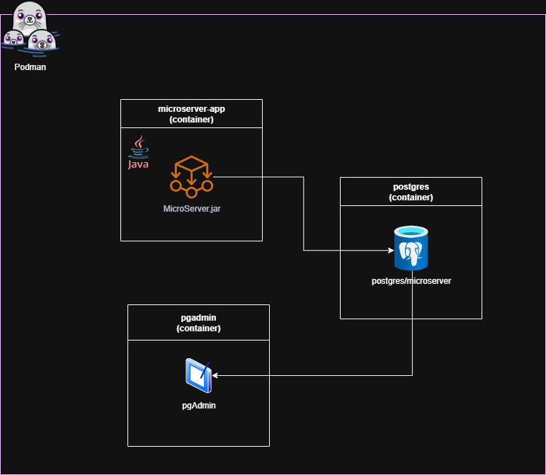
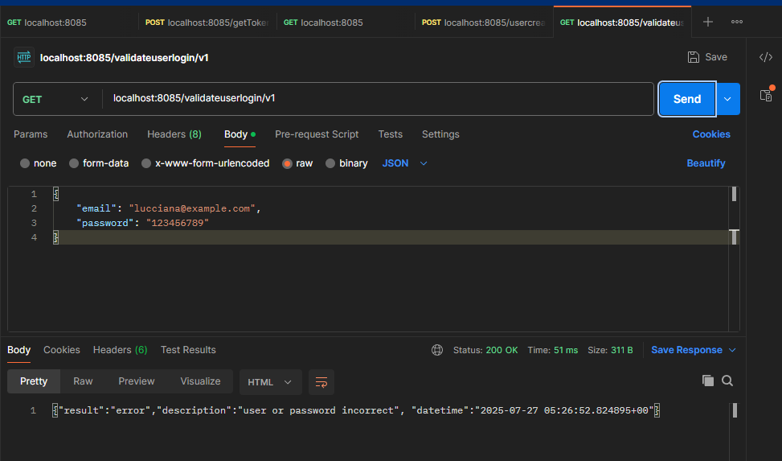

# microserverContanerized

This is the containerized version of [santimatiz/microserver](https://github.com/santimatiz/microserver) that I made this project based on the [API-REST con Postgresql y MicroServer course](https://www.udemy.com/course/api-rest-con-postgresql/).

This project is built using podman and this is how it works:

This project is organized this way:

- The folder 'microserver' is a copy of the original repo.
- The folder 'project_resources' contains all the scripts related to projects developed in the course.
- The folder 'microserver_containerized' is the folder where is possible to exec $podman compose up.

Notes:

- Optionally is possible to use the [wait-for-it](https://github.com/vishnubob/wait-for-it) script.

## Projects

### Project 1 evidences

### Project 2 evidences

### Project 3 evidences

### Project 6 evidences

